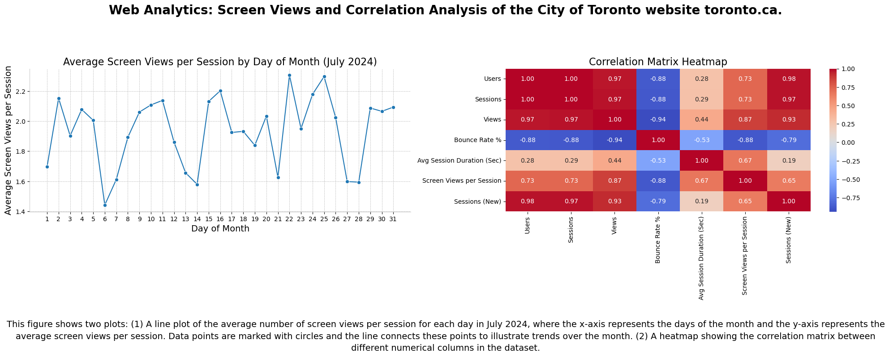
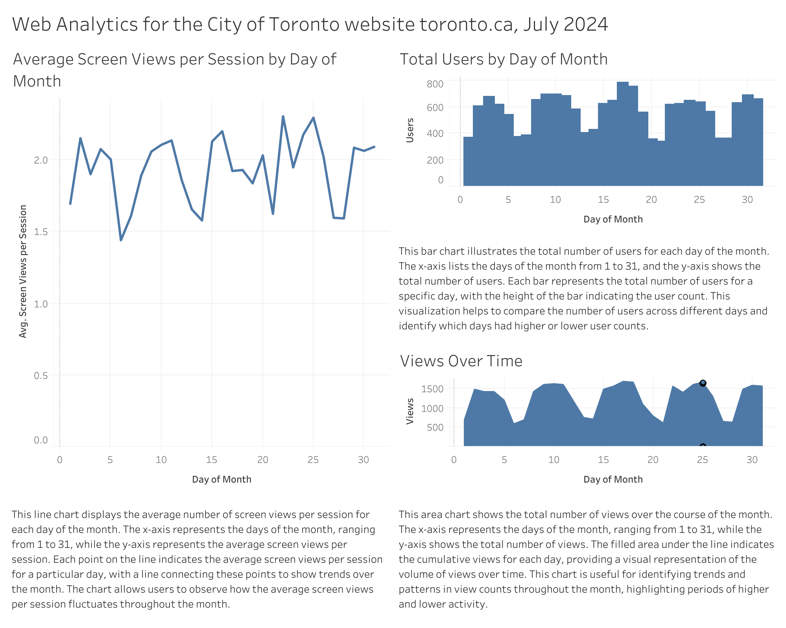

# Data Visualization

## Assignment 4: Final Project

### Requirements:
- We will finish this class by giving you the chance to use what you have learned in a practical context, by creating data visualizations from raw data. 
- Choose a dataset of interest from the [City of Toronto’s Open Data Portal](https://www.toronto.ca/city-government/data-research-maps/open-data/) or [Ontario’s Open Data Catalogue](https://data.ontario.ca/). 
- Using Python and one other data visualization software (Excel or free alternative, Tableau Public, any other tool you prefer), create two distinct visualizations from your dataset of choice.  
- For each visualization, describe and justify: 
    > What software did you use to create your data visualization?

    > Who is your intended audience? 
    
    > What information or message are you trying to convey with your visualization? 
    
    > What design principles (substantive, perceptual, aesthetic) did you consider when making your visualization? How did you apply these principles? With what elements of your plots? 
    
    > How did you ensure that your data visualizations are reproducible? If the tool you used to make your data visualization is not reproducible, how will this impact your data visualization? 
    
    > How did you ensure that your data visualization is accessible?  
    
    > Who are the individuals and communities who might be impacted by your visualization?  
    
    > How did you choose which features of your chosen dataset to include or exclude from your visualization? 
    
    > What ‘underwater labour’ contributed to your final data visualization product?
    
-----------------------------------------------------------------------------------------------------------------------------

## Data Visualization with Python

#### Resources: 

Dataset: - Web analytics of the City of Toronto website toronto.ca.
[https://open.toronto.ca/dataset/web-analytics/](https://open.toronto.ca/dataset/web-analytics/)

Data:
[assignment_4_materials/data/key_metrics_202407.csv](assignment_4_materials/data/key_metrics_202407.csv)

Code:
[assignment_4_materials/assignment_4_code.ipynb](assignment_4_materials/assignment_4_code.ipynb)

Data Visualization: 
[assignment_4_materials/python-data-vis.png](assignment_4_materials/python-data-vis.png)

### Description:
    > Software: Python, Numpy, Matplotlib, Pandas, Seaborn.

    > Intended audience: The intended audience for this data visualization includes web analytics professionals, digital marketers, city planners, and stakeholders involved in the management and improvement of the City of Toronto’s website, toronto.ca.
    
    > Message of the visualization: The visualizations aim to provide insights into user behavior and website performance metrics for the City of Toronto's website throughout July 2024. Specifically, the line plot shows the average screen views per session by day of the month, while the heatmap displays the correlation between various web metrics. These visualizations help identify trends, patterns, and relationships in the data, which can guide decision-making and strategy development.
    
    > Design principles consideration:
        Substantive Principles:
        Relevance: Only included relevant metrics such as Users, Sessions, Views, Bounce Rate, Avg Session Duration, Screen Views per Session, and Sessions (New) to focus on key performance indicators.
        Accuracy: Ensured data integrity by excluding the first row, which contained unclear data.
        Perceptual Principles:
        Clarity: Used clear labels and titles to ensure the audience can easily understand the data presented.
        Readability: Chose appropriate font sizes and styles for text elements, ensuring they are legible.
        Aesthetic Principles:
        Consistency: Maintained a consistent color scheme and formatting style across the plots to create a cohesive visual experience.
        Simplicity: Simplified the visual elements by removing unnecessary gridlines and reducing chart clutter (e.g., hiding top and right spines).
        
    > Reproducibility: I provided complete Python code and saved the processed data to a new CSV file, ensuring the results can be verified and shared.
    
    > Accessibility: I added descriptions, used accessible color schemes, ensured legibility, and provided alternative text.
    
    > Individuals and communities impacts:  City officials, residents, visitors, and web analytics professionals can benefit from the insights provided.
    
    > Features desicions: Only included relevant web performance metrics and excluded the first row due to unclear data.
    
    > ‘Underwater labour’: Efforts included data cleaning, code development, design and formatting, and documentation to ensure accuracy and clarity.

---------

## Data Visualization with Tableau

#### Resources: 

Dataset: - Web analytics of the City of Toronto website toronto.ca.
[https://open.toronto.ca/dataset/web-analytics/](https://open.toronto.ca/dataset/web-analytics/)

Data:
[assignment_4_materials/data/key_metrics_202407.csv](assignment_4_materials/data/key_metrics_202407.csv)

Tableau Public Dashboard:
[https://public.tableau.com/views/WebAnalyticsfortheCityofTorontowebsitetoronto_ca_/Dashboard1?:language=en-US&:sid=&:redirect=auth&:display_count=n&:origin=viz_share_link](https://public.tableau.com/views/WebAnalyticsfortheCityofTorontowebsitetoronto_ca_/Dashboard1?:language=en-US&:sid=&:redirect=auth&:display_count=n&:origin=viz_share_link)

Data Visualization: 
[assignment_4_materials/tableau-data-vis.png](assignment_4_materials/tableau-data-vis.png)

### Description:
    > Software: Tableau Public.

    > Intended audience: The intended audience for this data visualization includes web analytics professionals, digital marketers, city planners, and stakeholders involved in the management and improvement of the City of Toronto’s website, toronto.ca.
    
    > Message of the visualization: The visualizations aim to provide insights into user behavior and website performance metrics for the City of Toronto’s website throughout July 2024.
    
    > Design principles consideration: I considered relevance by focusing on key metrics, clarity by using clear labels and titles, and consistency by maintaining a cohesive color scheme and clean layout across the plots.
        
    > Reproducibility: To make the Tableau dashboard reproducible, I ensured that the dataset is saved and shared along with the Tableau workbook. However, since Tableau does not support version control and may require manual adjustments, full reproducibility might be challenging. This can impact the ability to exactly replicate the visualizations if the data source or original settings are not accessible.
    
    > Accessibility: I added detailed descriptions for each plot, used color schemes accessible to those with color vision deficiencies, ensured legibility through appropriate font sizes and styles, and included alternative text.
    
    > Individuals and communities impacts:  City officials, residents, visitors, and web analytics professionals can benefit from the insights provided.
    
    > Features desicions: Only included relevant web performance metrics and excluded the first row due to unclear data.
    
    > ‘Underwater labour’: The process involved data cleaning, configuring Tableau settings, designing the dashboard layout, and documenting insights to ensure clarity, accuracy, and accessibility.

-----------------------------------------------------------------------------------------------------------------------------

- This assignment is intentionally open-ended - you are free to create static or dynamic data visualizations, maps, or whatever form of data visualization you think best communicates your information to your audience of choice! 
- Total word count should not exceed **(as a maximum) 1000 words** 
 
### Why am I doing this assignment?:  
- This ongoing assignment ensures active participation in the course, and assesses the learning outcomes: 
* Create and customize data visualizations from start to finish in Python
* Apply general design principles to create accessible and equitable data visualizations
* Use data visualization to tell a story  
- This would be a great project to include in your GitHub Portfolio – put in the effort to make it something worthy of showing prospective employers!

### Rubric:

| Component         | Scoring  | Requirement                                                                 |
|-------------------|----------|-----------------------------------------------------------------------------|
| Data Visualizations | Complete/Incomplete | - Data visualizations are distinct from each other - Data visualizations are clearly identified - Different sources/rationales (text with two images of data, if visualizations are labeled) - High-quality visuals (high resolution and clear data) - Data visualizations follow best practices of accessibility |
| Written Explanations | Complete/Incomplete | - All questions from assignment description are answered for each visualization - Explanations are supported by course content or scholarly sources, where needed |
| Code              | Complete/Incomplete | - All code is included as an appendix with your final submissions - Code is clearly commented and reproducible |

## Submission Information

🚨 **Please review our [Assignment Submission Guide](https://github.com/UofT-DSI/onboarding/blob/main/onboarding_documents/submissions.md)** 🚨 for detailed instructions on how to format, branch, and submit your work. Following these guidelines is crucial for your submissions to be evaluated correctly.

### Submission Parameters:
* Submission Due Date: `HH:MM AM/PM - DD/MM/YYYY`
* The branch name for your repo should be: `assignment-4`
* What to submit for this assignment:
    * A folder/directory containing:
        * This file (assignment_4.md)
        * Two data visualizations 
        * Two markdown files for each both visualizations with their written descriptions.
        * Link to your dataset of choice.
        * Complete and commented code as an appendix (for your visualization made with Python, and for the other, if relevant) 
* What the pull request link should look like for this assignment: `https://github.com/<your_github_username>/visualization/pull/<pr_id>`
    * Open a private window in your browser. Copy and paste the link to your pull request into the address bar. Make sure you can see your pull request properly. This helps the technical facilitator and learning support staff review your submission easily.

Checklist:
- [ ] Create a branch called `assignment-4`.
- [ ] Ensure that the repository is public.
- [ ] Review [the PR description guidelines](https://github.com/UofT-DSI/onboarding/blob/main/onboarding_documents/submissions.md#guidelines-for-pull-request-descriptions) and adhere to them.
- [ ] Verify that the link is accessible in a private browser window.

If you encounter any difficulties or have questions, please don't hesitate to reach out to our team via our Slack at `#cohort-3-help`. Our Technical Facilitators and Learning Support staff are here to help you navigate any challenges.
